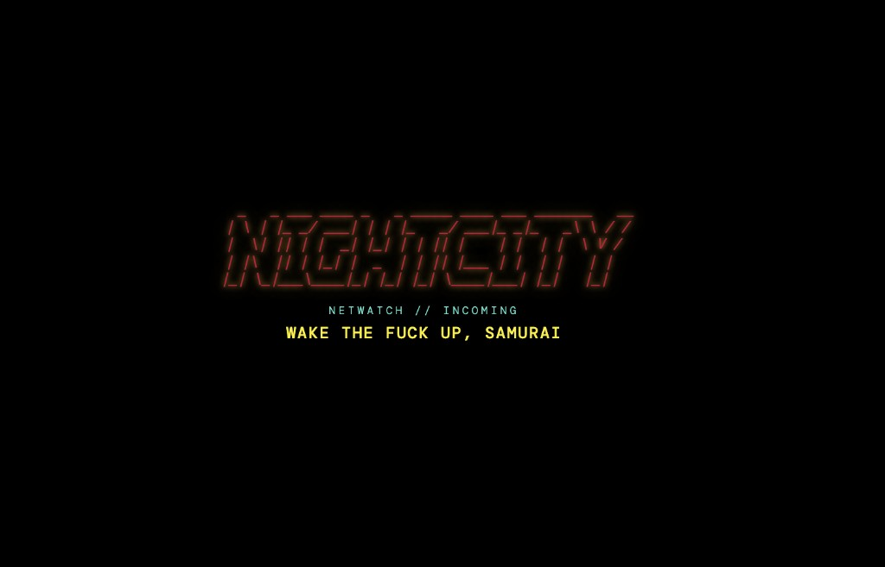
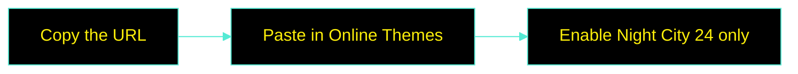
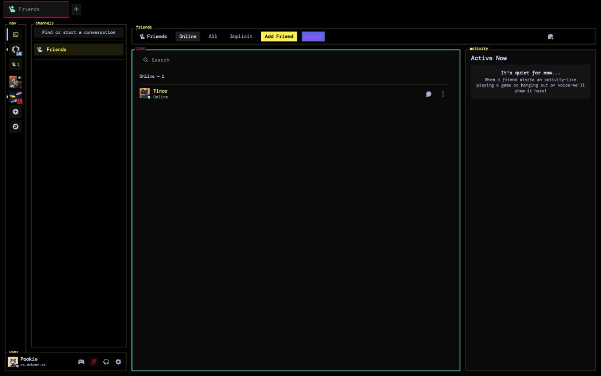
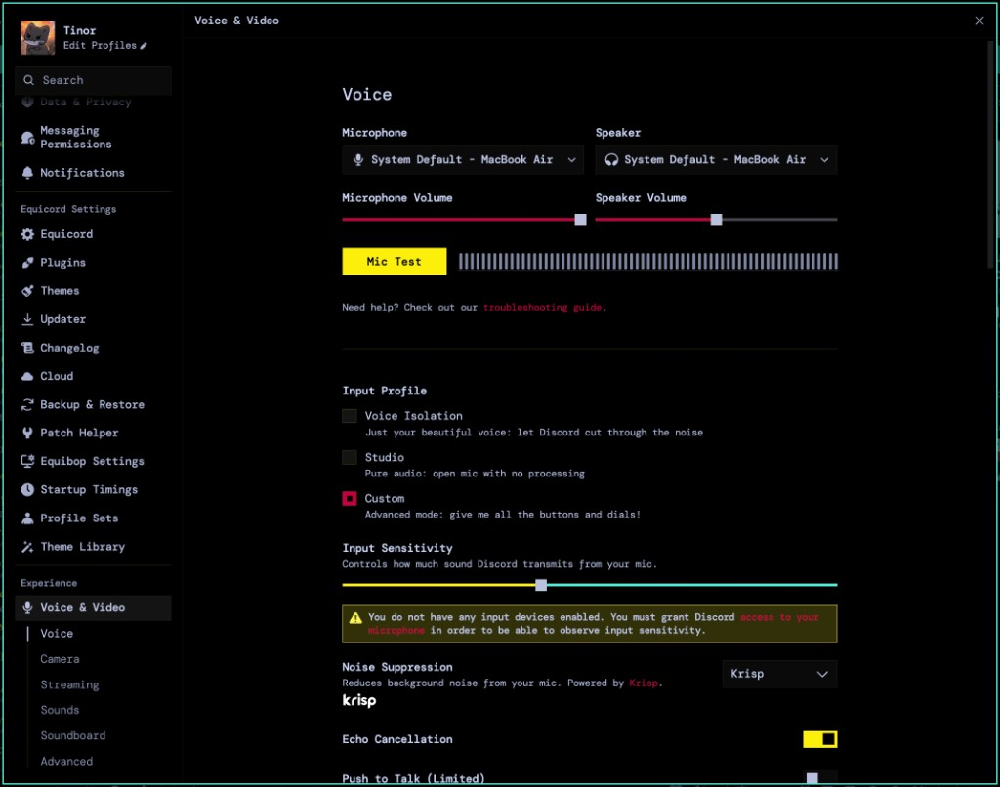
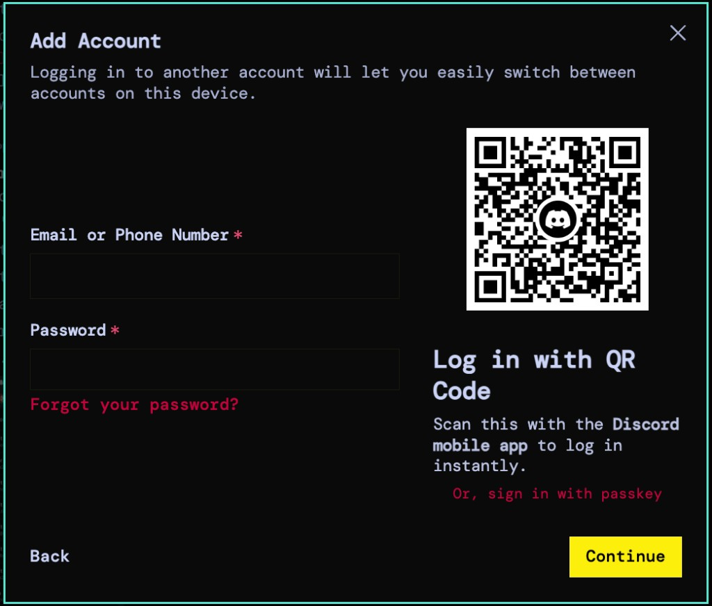

<div align="center">



# Night City 24

**Wake the fuck up, samurai.** Black chrome TUI for Equibop / Equicord / Vencord.

One CSS file. Paste a link or drop it in Themes. No scripts, no builds, no extra packages.

[](https://github.com/TinorNoah/nightcity24/blob/main/nightcity24.theme.css)
[](https://github.com/Equicord/Equibop)
[](https://equicord.org/)
[](https://vencord.dev/)
[](https://github.com/TinorNoah/nightcity24/stargazers)
[](https://github.com/TinorNoah/nightcity24/commits/main)
[](https://discord.gg/ukdfjvYsKa)

[Preview](#preview) · [Install](#install) · [Palette](#palette) · [Features](#whats-inside) · [Feedback](#feedback) · [FAQ](#faq) · [Credits](#credits)

</div>

> [!IMPORTANT]
> Enable **Night City 24** as the only theme. Do not also enable Midnight, system24, or Private Channel Recolor. Night City already ships system24 plus lock recolor, and stacking themes makes Equibop sluggish.

## Install

Settings → Themes → Online Themes / Theme Links → paste this, then enable **Night City 24** only:

```text
https://raw.githubusercontent.com/TinorNoah/nightcity24/main/nightcity24.theme.css
```

<p align="center">
  <a href="https://raw.githubusercontent.com/TinorNoah/nightcity24/main/nightcity24.theme.css"></a>
  <a href="https://discord.gg/ukdfjvYsKa"></a>
  <a href="https://github.com/TinorNoah/nightcity24/stargazers"></a>
</p>



<details>
<summary><strong>Install from a local file</strong> — macOS / Windows / Linux paths</summary>

1. Download [`nightcity24.theme.css`](https://raw.githubusercontent.com/TinorNoah/nightcity24/main/nightcity24.theme.css)
2. Drop it in your themes folder:

| OS | Path |
| --- | --- |
| macOS | `~/Library/Application Support/equibop/themes` |
| Windows | `%APPDATA%\equibop\themes` |
| Linux | `~/.config/equibop/themes` |

3. Themes → Local → enable **Night City 24**

> [!TIP]
> If GitHub rate-limits the raw URL (theme fails to load, 429), use the local file. Same CSS, no network.

</details>

## Preview

<table>
  <tr>
    <td width="50%">
      
      <p align="center"><sub><code>home</code> · Friends / DMs</sub></p>
    </td>
    <td width="50%">
      
      <p align="center"><sub><code>settings</code> · Voice &amp; Video</sub></p>
    </td>
  </tr>
  <tr>
    <td>
      
      <p align="center"><sub><code>login</code> · Add Account</sub></p>
    </td>
    <td>
      
      <p align="center"><sub><code>splash</code> · NIGHTCITY loader</sub></p>
    </td>
  </tr>
</table>

## Palette

Night City black, neon yellow, neon red, cyan. Red stays visible but does not eat the whole UI.

| Swatch | Hex | Used for |
| --- | --- | --- |
| [](#palette) | `#000000` | Panels, backgrounds |
| [](#palette) | `#fcee0a` | Categories, idle chrome, friend / DM **names** |
| [](#palette) | `#c5003c` | Links, selection, mentions, unread names, jump highlights |
| [](#palette) | `#55ead4` | Icons, dates, active chrome |

Font is **DM Mono**. Panel labels (`nav`, `channels`, `friends`, `user`, …) sit on the wireframe borders.

## What's Inside

| | | |
| :---: | --- | --- |
| `01` | **One file** | `nightcity24.theme.css` — install via link or drop-in. No scripts, no build step, no npm. |
| `02` | **system24 chassis** | `@import` of [refact0r/system24](https://github.com/refact0r/system24). TUI panels, labels, ASCII titles. |
| `03` | **Night City paint** | Black chrome, yellow idle, red signal, cyan active. Friend / DM names stay yellow. |
| `04` | **Custom splash** | Animated **NIGHTCITY** ASCII + *WAKE THE FUCK UP, SAMURAI* — not a flat tint. |
| `05` | **Terminal home** | Baked `>_` glyph on Home / DMs. No extra icon CDNs. |
| `06` | **Locks included** | Private-channel lock recolor from [KrstlSkll69/vc-snippets](https://github.com/KrstlSkll69/vc-snippets) is already in the file. |
| `07` | **Equibop fixes** | Header gap, labels, Quick Switcher, stream / Go Live so video is not clipped. |
| `08` | **Kept snappy** | Zeroed hover transitions, no stacked themes, no expensive overlay sheets. |

## Compatibility

| Client | Status |
| --- | --- |
| **Equibop** | Primary target (Windows + macOS) |
| **Equicord** | Supported |
| **Vencord** | Supported |
| BetterDiscord / others | Untested — same CSS *may* load, not a goal |

Do not stack Night City 24 with:

| Leave off | Why |
| --- | --- |
| Midnight | Core layout already comes from system24 |
| system24 / system24-cyberpunk | Night City **is** the flavor |
| Private Channel Recolor | Already baked in; duplicate CSS = lag |

## Customize

Open `nightcity24.theme.css` and edit the variables at the top. Common knobs:

| Variable | Default | What it does |
| --- | --- | --- |
| `--font` / `--code-font` | `'DM Mono'` | Set to `''` for Discord’s default font |
| `--gap` | `16px` | Spacing between panels |
| `--animations` | `on` | `off` to kill transitions |
| `--panel-labels` | `on` | Wireframe labels on panels |
| `--ascii-titles` | `on` | ASCII channel titles |

Keep Night City as the only enabled theme after you edit. Changes in Quick CSS are unnecessary — bake it in the file.

## Feedback

Bugs, palette nits, Equibop weirdness, feature asks — drop them in Discord.

<p align="center">
  <a href="https://discord.gg/ukdfjvYsKa"></a>
</p>

<div align="center">

`https://discord.gg/ukdfjvYsKa`

</div>

## FAQ

<details>
<summary><strong>Theme looks sluggish / Equibop stutters</strong></summary>

Disable every other theme and snippet overlay. Night City already includes system24 + lock recolor. Stacking Midnight or Private Channel Recolor is the usual cause.

</details>

<details>
<summary><strong>Online theme link fails to load</strong></summary>

GitHub sometimes 429s the raw URL. Download the CSS and use **Install from a local file** instead.

</details>

<details>
<summary><strong>Home / DMs is still the Discord logo</strong></summary>

The terminal `>_` icon is baked into this file. Confirm only Night City 24 is enabled, then fully restart Equibop.

</details>

<details>
<summary><strong>Can I keep Midnight or Quick CSS overlays?</strong></summary>

No. Bake fixes into `nightcity24.theme.css`. Extra sheets fight this theme and cost frames.

</details>

## Credits

- **Original theme:** [refact0r](https://www.refact0r.dev/) — [system24](https://github.com/refact0r/system24)  
  Night City is a cyberpunk flavor on system24’s layout, panel labels, and loader (`@import` of the official build CSS).
- **Private channel locks:** adapted from [KrstlSkll69/vc-snippets](https://github.com/KrstlSkll69/vc-snippets)
- **Remix / Night City styling:** [TinorNoah](https://github.com/TinorNoah)

Repo: [TinorNoah/nightcity24](https://github.com/TinorNoah/nightcity24)

---

<div align="center">

`NETWATCH // OUT`

**Star the repo if Night City lives on your client.**  
**[Leave feedback on Discord](https://discord.gg/ukdfjvYsKa)** if something breaks or glows wrong.

[↑ back to top](#night-city-24)

</div>
